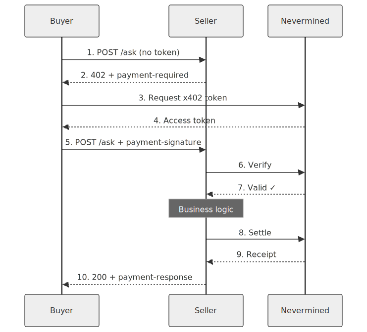

<!-- _class: title -->

# x402: Payments for AI Agents

### Crypto & Fiat on the Same Protocol

Nevermined + Stripe + x402

<!--
Welcome to the second workshop. In the last session we built an agent and monetized it. Now we're going to look under the hood — how does the payment protocol actually work? And how does it support both crypto and traditional card payments through the same code?
-->

---

# The Problem

## How do AI agents pay each other?

- Agents can't swipe credit cards
- Traditional payment APIs are designed for **human checkout flows**
- We need **machine-to-machine payments** over HTTP
- Payments should be **per-request**, not just subscriptions
- Must work for both **agent buyers** and **human buyers**

> What if payments were as simple as HTTP headers?

<!--
We're entering a world where AI agents do work autonomously. An agent searches the web, another analyzes data, another generates reports. But how does Agent A pay Agent B for its work?

Traditional payment APIs — Stripe checkout, PayPal buttons — are designed for humans clicking through a browser. Agents need something that works over plain HTTP, programmatically, per-request. That's what x402 solves.
-->

---

# HTTP Status Code 402

> **402 Payment Required**
> *"Reserved for future use"* — HTTP/1.1 Spec, **1997**

The future took 27 years to arrive.

```
200 OK              →  "Here's your data"
401 Unauthorized    →  "Who are you? Log in first"
402 Payment Required →  "I know who you are. Now pay me."
403 Forbidden       →  "No. Go away."
404 Not Found       →  "That doesn't exist"
```

x402 finally gives 402 a purpose: **standardized payment negotiation over HTTP.**

<!--
Here's a fun fact. HTTP status code 402 — Payment Required — was defined in 1997 and has been "reserved for future use" ever since. Every web developer has seen it in the spec. Nobody used it.

x402 finally gives it a purpose. When a server returns 402, it's saying: "I know who you are, your authentication is fine, but you need to pay to access this resource." And it tells you exactly how to pay, right in the response headers.
-->

---

<!-- _class: diagram -->

# The x402 Flow



<!--
Here's the full flow. Walk through each step:

1-2: Client calls the endpoint without a token. The middleware returns 402 with a payment-required header that tells the client what to pay — the plan ID, the accepted payment scheme, and how many credits.

3-4: Client asks Nevermined for an access token. This is where the payment happens — either crypto credits are reserved or a card delegation is set up.

5-7: Client retries with the token in the payment-signature header. The middleware verifies the token with Nevermined — is it valid? Does the buyer have enough credits?

8-9: After executing the business logic, the middleware settles — burns the credits on-chain and gets a receipt.

10: Client gets the response with a payment-response header containing the receipt — how many credits were used, the remaining balance, and a transaction hash.

All standard HTTP. No WebSockets, no special protocols.
-->

---

# The Three Headers

| Header | Direction | When | Contains |
|--------|-----------|------|----------|
| `payment-required` | Server → Client | 402 response | What to pay |
| `payment-signature` | Client → Server | Retry request | Proof of payment |
| `payment-response` | Server → Client | 200 response | Settlement receipt |

<!--
Three headers. That's the entire protocol surface. The payment-required header is base64-encoded JSON telling the client what to pay.
-->

---

# Decoded `payment-required` Header

```json
{
  "x402Version": 2,
  "resource": { "url": "POST /ask" },
  "accepts": [{
    "scheme": "nvm:erc4337",
    "network": "eip155:84532",
    "planId": "plan_abc123",
    "extra": { "agentId": "agent_xyz" }
  }]
}
```

The `accepts` array can list **multiple schemes** — an agent can have multiple plans (e.g. one crypto, one fiat). The client picks the one it prefers.

<!--
This is the decoded payment-required header. It tells the client the protocol version, what resource costs money, and what payment schemes are accepted. Notice the accepts array — it can list multiple schemes.
-->

---

# Verify & Settle: The Two-Step

### Verify (read-only check)
> "Is this token valid? Does the buyer have credits?"

- No credits burned
- No money charged
- Safe to call multiple times

### Settle (write operation)
> "Burn the credits. Record the transaction."

- Credits burned on-chain (ERC-1155)
- Or card charged (for fiat)
- Returns transaction hash + receipt

**The seller never touches the buyer's wallet or card directly.**

Nevermined acts as the facilitator for both steps.

<!--
The payment flow has two distinct steps: verify and settle.

Verify is a read-only check — is the token valid, does the buyer have enough credits? No money moves. This happens before your business logic runs.

Settle is the write operation — it actually burns the credits or charges the card. This happens after your business logic succeeds. If your endpoint throws an error, no credits are burned.

Importantly, the seller never touches the buyer's wallet or credit card directly. Nevermined acts as the trusted facilitator. This is key for security — the seller only gets a token, never payment credentials.
-->

---

<!-- _class: title -->

# Demo 1: Crypto Flow

### `nvm:erc4337` — On-chain credits on Base

<!--
Let's see the crypto flow in action. I have an agent running with x402 middleware. We'll call it without payment, see the 402, then do the full payment cycle.
-->

---

# Crypto Flow — Live Demo

### 1. Call without payment → 402
```bash
curl -X POST http://localhost:3000/ask \
  -H "Content-Type: application/json" \
  -d '{"query": "AI trends 2026"}' -v
```

### 2. Decode the payment-required header
```bash
echo "<base64>" | base64 -d | python -m json.tool
# → scheme: "nvm:erc4337", network: "eip155:84532"
```

---

# Crypto Flow — Client Output

### 3. Run client (full flow)
```bash
poetry run python -m src.client
```
```
POST /ask (no token)   -> 402 Payment Required
Generated access token -> Using Nevermined SDK
POST /ask (with token) -> 200 OK

Settlement (payment-response header):
{
  "status": "settled",
  "creditsUsed": 1,
  "remainingCredits": 99,
  "txHash": "0xabc...def",
  "network": "eip155:84532"
}
```

<!--
Let me run this live. First, a curl request without any payment token. Watch the response — HTTP 402, and in the headers you'll see payment-required with the base64-encoded JSON.

Let me decode that — see, it says scheme nvm:erc4337, network eip155:84532 which is Base Sepolia, and the plan ID. This is the crypto scheme.

Now the client script does the full dance: gets a token, retries, and we get the 200 with our answer. In the payment-response header you'll see the credits burned and a transaction hash.

Let me show you this transaction on the Nevermined dashboard and Base Sepolia explorer — that's a real on-chain credit burn. Fully transparent.
-->

---

<!-- _class: diagram -->

# Two Schemes, One Protocol



<!--
Here's the big reveal of this workshop. x402 supports two payment schemes, but the protocol — the HTTP headers, the flow, the SDK calls — is exactly the same.

The crypto scheme uses on-chain ERC-1155 credit tokens on Base. The fiat scheme uses Stripe card delegation. But from the seller's perspective, you write one middleware line and it handles both.

The difference is entirely in how the buyer gets their token and how settlement happens behind the scenes. Let me show you both side by side.
-->

---

# Side-by-Side Comparison

| Aspect | Crypto `nvm:erc4337` | Fiat `nvm:card-delegation` |
|--------|---------------------|---------------------------|
| **Plan pricing** | USDC (crypto) | USD (fiat) |
| **Plan `isCrypto`** | `true` | `false` |
| **Buyer pays with** | USDC on Base chain | Credit card via Stripe |
| **Credit storage** | ERC-1155 on-chain | ERC-1155 on-chain (auto-minted) |
| **Settlement** | Burn on-chain | Charge card → mint → burn |
| **Network** | `eip155:84532` | `stripe` |
| **Buyer needs** | Crypto wallet + USDC | Card enrolled in nevermined.app |
| **Seller code** | `PaymentMiddleware(...)` | `PaymentMiddleware(...)` |
| **Same middleware?** | **YES** | **YES** |

<!--
Let me highlight the key differences.

Crypto: the buyer needs a crypto wallet with USDC. They buy credits on-chain, and settlement burns those credits directly.

Fiat: the buyer enrolls a credit card in the Nevermined app. On settlement, if they're out of credits, the card is charged automatically, credits are minted on-chain, then burned. It's like auto-recharge on a prepaid account.

But look at the seller code row — it's identical. PaymentMiddleware. The same line. The middleware reads the plan metadata to determine which scheme to use. Zero code changes on the seller side.
-->

---

# How Fiat Works: Card Delegation

**Like a pre-authorized tab at a bar**

```
1. Buyer enrolls card at nevermined.app
   → Stripe pm_xxx stored securely

2. Buyer requests token with delegation config:
   ├── payment method:   pm_xxx
   ├── spending limit:   $100
   ├── duration:         7 days
   └── currency:         USD

3. Nevermined validates card ownership via Stripe API

4. Creates delegation + signs JWT token

5. On each request settlement:
   ├── Credits available? → Burn them (same as crypto)
   └── Credits exhausted? → Charge card → Mint credits → Burn
```

<!--
Let me explain the fiat flow in more detail. The concept is "card delegation" — the buyer gives Nevermined permission to charge their card up to a spending limit for a defined period. It's like opening a tab at a bar.

The buyer enrolls their card once at nevermined.app. Then when they request an access token, they include a delegation config with the spending limit, duration, and which card to use.

Nevermined validates that the card actually belongs to this user via the Stripe API, creates a delegation entity in the database, and signs a JWT.

On each request, if the buyer still has credits, they're burned normally — same as crypto. But when credits run out, Nevermined automatically charges the card, mints new credits on-chain, and burns them. The buyer's experience is seamless — their card just gets charged as they use the agent.
-->

---

<!-- _class: title -->

# Demo 2: Fiat / Stripe Flow

### `nvm:card-delegation` — Stripe card payments

<!--
Now let's see the fiat flow. Same agent, same code — I just point it to a fiat-priced plan.
-->

---

# Fiat Flow — Live Demo

### Same agent, different plan

```python
scheme = resolve_scheme(payments, plan_id)  # "nvm:card-delegation"

methods = payments.delegation.list_payment_methods()
print(f"Card: {methods[0].brand} *{methods[0].last4}")

token_options = X402TokenOptions(
    scheme=scheme,
    delegation_config=CardDelegationConfig(
        provider_payment_method_id=methods[0].id,
        spending_limit_cents=10_000,  # $100
        duration_secs=604_800,        # 7 days
        currency="usd",
    ),
)
token = payments.x402.get_x402_access_token(plan_id,
    token_options=token_options)
```

<!--
Here's the buyer side for fiat. The key difference: resolve_scheme reads the plan metadata and detects it's a fiat plan — isCrypto is false. Then we list the buyer's enrolled payment methods and build a CardDelegationConfig.

The delegation config says: use this specific card, allow up to $100 of charges, valid for 7 days, in USD.

Then we call the same get_x402_access_token function as before. The token that comes back contains a signed JWT with the delegation details.

Let me run this live and then check the Stripe dashboard...
-->

---

# Fiat Flow — What Happened

### In the terminal:
```
Detected scheme: nvm:card-delegation
Card: visa ending in 4242
Generated delegation token...
Calling /ask with payment-signature header...
200 OK ✓  Credits used: 1  Network: stripe
```

### Behind the scenes:
```
Card charged via Stripe  →  Credits minted on-chain  →  Credits burned (settlement)
```

Same ERC-1155 audit trail as crypto — Nevermined handles the Stripe integration transparently.

<!--
There it is. In the terminal — same 200 OK response, same credits used, but the network says "stripe" instead of a chain ID.

Behind the scenes, Nevermined charged the card via Stripe, minted credits on-chain, and burned them. The seller's code didn't change at all. You get the convenience of card payments with the transparency of blockchain settlement — all managed by Nevermined.
-->

---

# The Seller's Code — Same for Both

<div class="columns">
<div>

### Python (FastAPI)

```python
from payments_py import Payments, PaymentOptions
from payments_py.x402.fastapi import PaymentMiddleware

payments = Payments.get_instance(PaymentOptions(
    nvm_api_key=NVM_API_KEY,
    environment="sandbox",
))

app.add_middleware(PaymentMiddleware,
    payments=payments,
    routes={"POST /ask": {
        "plan_id": NVM_PLAN_ID, "credits": 1,
    }},
)
```

</div>
<div>

### TypeScript (Express)

```typescript
import { Payments } from "@nevermined-io/payments";
import { paymentMiddleware }
  from "@nevermined-io/payments/express";

const payments = Payments.getInstance({
    nvmApiKey: NVM_API_KEY,
    environment: "sandbox",
});

app.use(paymentMiddleware(payments, {
    "POST /ask": {
        planId: NVM_PLAN_ID, credits: 1,
    },
}));
```

</div>
</div>

**Both handle crypto AND fiat automatically. Zero scheme-specific code.**

<!--
I want to emphasize this point. Here's the complete seller code for both Python and TypeScript. This handles crypto, fiat, token verification, settlement, error responses — everything. The middleware reads the plan metadata and knows what to do.

If you create a crypto plan, it works. If you create a fiat plan, it works. If you create both plans on the same agent, it works. You never write scheme-specific code on the seller side.
-->

---

# The Buyer Adapts (Slightly)

```python
scheme = resolve_scheme(payments, plan_id)  # auto-detect from plan metadata

if scheme == "nvm:card-delegation":
    methods = payments.delegation.list_payment_methods()
    token_options = X402TokenOptions(scheme=scheme,
        delegation_config=CardDelegationConfig(
            provider_payment_method_id=methods[0].id,
            spending_limit_cents=10_000, duration_secs=604_800, currency="usd"))
else:
    token_options = X402TokenOptions(scheme=scheme)  # crypto — nothing extra

token = payments.x402.get_x402_access_token(plan_id, token_options=token_options)
```

<!--
The buyer side needs a bit more code for fiat — specifically the card delegation config. But it's straightforward: call resolve_scheme to auto-detect, then branch to add the delegation config if needed.

The key helper is resolve_scheme — it fetches the plan metadata, checks the isCrypto field, and returns the right scheme string. The buyer code just reacts to it.

And the final call — get_x402_access_token — is the same for both schemes. The SDK handles the differences internally.
-->

---

<!-- _class: diagram -->

# Architecture Overview



<!-- ```
┌────────────────────────────────────────────────────────────┐
│                    Nevermined Platform                       │
│                                                             │
│  ┌──────────────┐  ┌──────────────┐  ┌──────────────────┐  │
│  │  Plans API    │  │ Permissions  │  │   Delegation     │  │
│  │              │  │   (x402)     │  │    Service       │  │
│  │ - create     │  │              │  │                  │  │
│  │ - subscribe  │  │ - generate   │  │ - create         │  │
│  │ - balance    │  │ - verify     │  │ - validate card  │  │
│  │              │  │ - settle     │  │ - charge (Stripe)│  │
│  └──────────────┘  └──────────────┘  └──────────────────┘  │
│          │                │                │                 │
│  ┌───────▼────────────────▼────────────────▼─────────────┐  │
│  │            Smart Contracts (Base Chain)                │  │
│  │       ERC-1155 Credits: mint / burn / transfer        │  │
│  └───────────────────────────────────────────────────────┘  │
└────────────────────────────────────────────────────────────┘
           ▲                ▲                 ▲
           │                │                 │
     ┌─────┴─────┐   ┌─────┴─────┐    ┌──────┴──────┐
     │  Seller    │   │  Buyer    │    │   Stripe    │
     │  Agent     │   │  Agent    │    │   (fiat)    │
     │            │   │           │    │             │
     │ middleware │   │ get_token │    │ pm_xxx      │
     │ verify()   │   │           │    │ charge()    │
     │ settle()   │   │           │    │ → mint()    │
     └───────────┘   └───────────┘    └─────────────┘
``` -->

<!--
Here's the full architecture. At the top is the Nevermined platform with three services: Plans API for managing subscriptions and balances, Permissions for the x402 token lifecycle (generate, verify, settle), and the Delegation Service for fiat card management.

Below that, everything is anchored on smart contracts on Base chain — ERC-1155 credit tokens. Even fiat payments ultimately mint and burn these tokens, giving you a unified audit trail.

At the bottom: the seller calls verify and settle through the middleware. The buyer calls get_token through the SDK. And for fiat, Stripe is involved behind the scenes — charging the card and triggering credit minting.

The beauty is that the seller and buyer don't need to know about the smart contracts or Stripe. The SDKs and middleware abstract it all away.
-->

---

# When to Use Which?

| Use Case | Recommended | Why |
|----------|------------|-----|
| **Agent-to-agent** payments | Crypto | Agents don't have credit cards |
| **Human users** buying from agents | Fiat | Familiar payment experience |
| **Hackathon** prototyping | Crypto (sandbox) | Faster setup, no card enrollment |
| **Enterprise** customers | Fiat | Prefer invoices and cards |
| **Micropayments** (< $0.01) | Crypto | Card fees make micro-fiat impractical |
| **Global users** without crypto | Fiat | Lower barrier to entry |
| **Both types** of buyers | Both plans! | Same agent, two plans, same code |

> You don't have to choose upfront. Create two plans on the same agent.

<!--
So when should you use which? Here's a practical guide.

For agent-to-agent: crypto, because agents don't have credit cards. For human users: fiat, because they're used to cards. For hackathon prototyping: crypto on sandbox, because there's no card enrollment step.

But the real answer is: you don't have to choose. You can create two plans on the same agent — one crypto, one fiat — and your middleware handles both. Different buyers can pay in their preferred way.

For your hackathon projects, I'd recommend starting with crypto on sandbox since it's faster to set up. If you want to show off fiat payments, add a second plan later.
-->

---

# Key Takeaways

1. **x402 = HTTP payments via headers** — 402 response, `payment-signature`, settlement receipt
2. **Two schemes, one protocol** — crypto (ERC-4337) and fiat (Stripe card delegation)
3. **Seller code is scheme-agnostic** — one middleware line handles both
4. **Buyer adapts slightly for fiat** — `CardDelegationConfig` for fiat, nothing extra for crypto
5. **Credits are always on-chain** — even fiat mints ERC-1155 before burning

<!--
Let me leave you with these five takeaways. x402 makes payments as simple as HTTP headers. It supports both crypto and fiat through the same protocol. Sellers never write scheme-specific code. Buyers need slightly more setup for fiat. And everything is anchored on-chain for transparency, even card payments.
-->

---

# Resources

| | |
|---|---|
| Nevermined Docs | [nevermined.ai/docs](https://nevermined.ai/docs) |
| Nevermined App | [nevermined.app](https://nevermined.app) |
| x402 Protocol Spec | [github.com/coinbase/x402](https://github.com/coinbase/x402) |
| Payments Python SDK | [github.com/nevermined-io/payments-py](https://github.com/nevermined-io/payments-py) |
| Payments TypeScript SDK | [github.com/nevermined-io/payments](https://github.com/nevermined-io/payments) |
| Stripe Test Cards | [docs.stripe.com/testing#cards](https://docs.stripe.com/testing#cards) |
| Example Agents | [github.com/nevermined-io/hackathons/agents](https://github.com/nevermined-io/hackathons/tree/main/agents) |
| MCP Server | [docs.nevermined.app/mcp](https://docs.nevermined.app/mcp) |
| Discord | [discord.com/invite/GZju2qScKq](https://discord.com/invite/GZju2qScKq) |

<!--
Here are all the resources you'll need. The Nevermined docs have full API references for both SDKs. The example agents in this repo have working demos for each protocol. And we're available on Discord if you get stuck. Good luck with your projects!
-->
